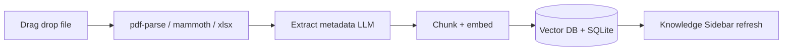
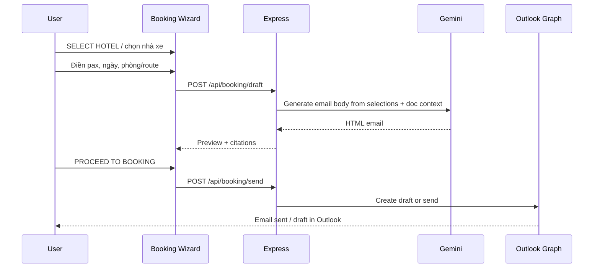

# TravelDoc Agent — RAG Learning & Build Plan

**Mục tiêu:** Xây ứng dụng RAG giống mockup *TravelDoc Agent V2.4 — Vietnam Travel Intelligence*, tự code từng bước để hiểu sâu hệ thống RAG. Corpus ban đầu: `docs/Hotels/2026`, `docs/Xe du lich`, và tài liệu người dùng upload.

**Nguyên tắc học:** Làm đủ 3 chiến lược (đơn giản → nâng cao → production). Mỗi chiến lược thêm tính năng UI/backend mới; không nhảy thẳng tới production.

---

## Tổng quan ứng dụng (theo mockup)

```text
┌─────────────────────────────────────────────────────────────────────────────┐
│  TravelDoc Agent V2.4          │  457 Documents  │  [Sync Database]        │
├──────────────┬──────────────────────────────────────┬───────────────────────┤
│ KNOWLEDGE    │  GROUNDED AI CHAT ROOM               │  DOCUMENT MANAGEMENT  │
│ SIDEBAR      │  - Prompt suggestions                │  - Drag & drop upload │
│ - Loại file  │  - Markdown + bảng so sánh           │  - Verified docs list │
│ - Thành phố  │  - Citations badges                  │  - Search             │
│ - Nhà xe/KS  │  - Hotel recommendation cards        │                       │
│              │                                      │  SMART BOOKING WIZARD │
│ COMPARISON   │  [Input: Ask about rates, buses...]  │  - Draft booking slip │
│ (chọn ≤3)    │                                      │  - Proceed to booking │
└──────────────┴──────────────────────────────────────┴───────────────────────┘
│ ENV: PRODUCTION │ LATENCY: 218ms │ CONNECTED │ Powered by @google/genai     │
└─────────────────────────────────────────────────────────────────────────────┘
```

---

## Stack đề xuất

| Layer | Công nghệ | Ghi chú |
|-------|-----------|---------|
| Frontend | **Next.js** (App Router) + Tailwind | 3 cột như mockup; `react-markdown` + remark-gfm cho bảng |
| Backend | **Express** (Node.js) | API upload, chat, compare, booking |
| Trích xuất | `pdf-parse`, `mammoth` (DOCX), `xlsx` (Excel), fs (MD/TXT) | Chạy trên server khi upload |
| LLM | **`@google/genai`** — `gemini-2.5-flash` hoặc `gemini-3.5-flash` khi có | Grounded RAG; API key trong `.env` |
| Embedding | `text-embedding-004` (Google) hoặc local `sentence-transformers` ở S1 | S1 có thể dùng local để học; S2+ dùng Google |
| Vector store | S1: JSON file + cosine | S2: **Chroma** local | S3: **Qdrant** Docker |
| Metadata DB | **SQLite** (S2+) | documents, categories, cities, booking drafts |
| Email | **Microsoft Graph** (Outlook) | S3: gửi email đặt chỗ sau wizard |

**Thư mục gợi ý** (tách khỏi `tour-ops-agent` nếu muốn học độc lập):

```text
traveldoc-agent/
  frontend/                 # Next.js
  backend/                  # Express
    src/
      ingest/               # pdf-parse, mammoth, xlsx
      rag/                  # chunk, embed, retrieve
      chat/                 # grounded prompt, citations
      compare/              # side-by-side extraction
      booking/              # wizard + outlook draft
  data/
    uploads/                # file gốc
    index/                  # vector + sqlite
  eval/golden_questions.jsonl
  README.md
```

---

## 4 module tính năng (map vào 3 chiến lược)

### Module 1 — Kênh Tri Thức & Trích Xuất (Knowledge Sidebar)

| Tính năng | Mô tả | Chiến lược |
|-----------|-------|------------|
| Drag-and-Drop Uploader | Kéo thả `.pdf`, `.docx`, `.xlsx`, `.md`, `.txt` → Express trích xuất text → index ngay | S1 (cơ bản), S2 (metadata), S3 (hash + incremental) |
| Phân loại tài liệu | Tự gán hoặc người dùng chọn: **Nhà xe** / **Khách sạn** / Khác | S2 |
| Bộ lọc thông minh | Tìm theo từ khóa, thành phố (Hà Nội, Đà Nẵng, TP.HCM, Nha Trang, Huế), loại file | S2 |
| Sync Database | Nút rebuild/re-index toàn bộ corpus | S3 |

**API gợi ý:** `POST /api/documents/upload`, `GET /api/documents?city=&category=&q=`, `POST /api/documents/sync`

**Luồng ingest:**



---

### Module 2 — Trợ Lý Trò Chuyện (Grounded AI Chat Room)

| Tính năng | Mô tả | Chiến lược |
|-----------|-------|------------|
| Grounded RAG | Chỉ trả lời từ chunks retrieved; từ chối nếu không có context | S1 |
| Gemini via `@google/genai` | `generateContent` với system prompt nghiêm ngặt | S2 |
| Prompt Suggestions | Chip nút: so sánh giá xe, hạng phòng Metropole, spa Fusion Phú Quốc… | S2 |
| Citations | Badge tên file nguồn dưới mỗi câu trả lời | S2 |
| Markdown & bảng | `react-markdown` + GFM → bảng HTML có viền | S2 |
| Hotel cards | LLM trả JSON structured → UI card (giá, sao, nút SELECT HOTEL) | S3 |

**System prompt mẫu (bạn tự viết khi code):**

```text
You are TravelDoc Agent for Vietnam travel operators.
- Answer ONLY from the provided document context.
- If context is insufficient, say "Không tìm thấy trong tài liệu đã nạp."
- Cite sources as [filename] after each claim.
- For comparisons, output a Markdown table with columns: Provider | Price | Policy | Contact.
```

**API:** `POST /api/chat` body `{ message, filters?, sessionId }` → `{ answer, citations[], tables?, suggestions[] }`

---

### Module 3 — Bảng So Sánh Dịch Vụ (Service Comparison Grid)

| Tính năng | Mô tả | Chiến lược |
|-----------|-------|------------|
| Chọn tối đa 3 tài liệu | Checkbox ở sidebar trái | S3 |
| Side-by-side grid | Cột = tài liệu; hàng = chỉ số | S3 |
| Trường tự động | Giá vé, lộ trình, ghế, sao KS, hotline, hoàn/hủy | S3 |

**Cách làm:** Gọi Gemini với schema JSON cố định, mỗi doc một lần extract → merge thành grid.

```json
{
  "provider": "",
  "price": "",
  "route": "",
  "seat_quality": "",
  "star_rating": "",
  "hotline": "",
  "cancellation_policy": ""
}
```

**API:** `POST /api/compare` body `{ documentIds: string[] }` → `{ columns[], rows[] }`

---

### Module 4 — Smart Booking Wizard & Outlook Email

| Tính năng | Mô tả | Chiến lược |
|-----------|-------|------------|
| Draft Booking Slip | Tóm tắt: xe/KS đã chọn, route, ngày, pax, phòng | S3 |
| Form đặt chỗ | KS: số khách, loại phòng, check-in/out. Xe: số khách, ngày đi, đón/đến | S3 |
| Soạn email | Template tiếng Anh/Việt theo loại NCC (giống `draft_hotel_email` trong tour-ops) | S3 |
| Gửi Outlook | Microsoft Graph `sendMail` hoặc tạo draft để user duyệt | S3 |

**Luồng:**



**API:** `POST /api/booking/draft`, `POST /api/booking/send` (cần `AZURE_CLIENT_ID`, `AZURE_TENANT_ID` — tham khảo `app/agents/supplier_booking.py` trong repo tour-ops)

---

## Chiến lược 1 — Naive RAG + UI tối thiểu

**Mục đích:** Hiểu pipeline RAG end-to-end; chưa cần đẹp như mockup.

**Bạn tự code:**

1. **Express skeleton** — `POST /upload`, `POST /chat`, serve static hoặc Next.js đơn giản.
2. **Ingest** — `pdf-parse`, `mammoth`, `xlsx` → plain text; lưu `data/uploads/`.
3. **Chunk** — 800 ký tự, overlap 100; metadata `{ source, category: "unknown" }`.
4. **Embed + retrieve** — `sentence-transformers` local HOẶC `text-embedding-004`; lưu vectors trong JSON; cosine top-4.
5. **Chat** — stuff context vào prompt; gọi `@google/genai` (hoặc Ollama nếu muốn zero-cost lúc học).
6. **UI tối thiểu** — 1 ô chat + danh sách file đã upload (chưa có filter, chưa có bảng đẹp).

**Deliverable:** Upload → hỏi → trả lời grounded (text thuần). ~200–300 dòng backend.

**Kiểm tra:** 5 câu hỏi mẫu trong `eval/golden_questions.jsonl` — ghi lại câu trả lời có đúng tài liệu không.

---

## Chiến lược 2 — RAG chất lượng + UI giống mockup (phần lớn)

**Mục đích:** Fix retrieval; dựng giao diện 3 cột và chat room đầy đủ.

**Nâng cấp so với S1:**

| Hạng mục | Chi tiết |
|----------|----------|
| Vector DB | **Chroma** persistent |
| Metadata | SQLite: `id, filename, category, city, doc_type, content_hash, indexed_at` |
| LLM metadata extract | Sau upload, Gemini trích `category`, `city`, `provider_name` |
| Hybrid search | Dense + BM25 (hoặc keyword filter trên SQLite trước, rồi vector) |
| Knowledge Sidebar | Filter loại file, thành phố, Nhà xe/Khách sạn; search box |
| Chat Room | Prompt suggestion chips; `react-markdown` + bảng GFM |
| Citations | Trả `citations: [{ docId, filename, snippet }]`; hiển thị badge |
| Upload panel phải | Drag-drop + danh sách Verified Documents |
| Eval | `ragas` hoặc checklist thủ công: faithfulness, citation đúng file |

**Deliverable:** App dùng được hàng ngày — hỏi giá xe, tra cứu KS, xem bảng so sánh trong chat.

**Gợi ý prompt suggestions (hardcode trước, sau đó LLM sinh động):**

- So sánh giá xe Đà Nẵng – Hội An
- Limousine Hà Nội đi Hạ Long
- Hạng phòng cổ kính Metropole Hà Nội
- Chính sách spa miễn phí Fusion Phú Quốc

---

## Chiến lược 3 — Production-minded (so sánh + booking + Outlook)

**Mục đích:** Đủ tính năng như mockup; sẵn sàng dùng thật cho điều hành tour.

**Nâng cấp so với S2:**

| Hạng mục | Chi tiết |
|----------|----------|
| Ingest incremental | `content_hash` — chỉ re-embed file đổi |
| Vector DB | **Qdrant** Docker; filter metadata native |
| Comparison Grid | Chọn ≤3 doc → API `/compare` → grid song song |
| Hotel recommendation cards | Structured output JSON → card + nút SELECT HOTEL |
| Smart Booking Wizard | State trong React context / Zustand; Draft Booking Slip |
| Email composer | Template KS/xe; HTML đẹp (font Cambria như tour-ops) |
| Outlook | Graph API OAuth; gửi hoặc draft |
| Header/Footer | Document count, Sync Database, latency, connection status |
| Observability | Log `requestId`, retrieval chunks, token usage |
| Guardrails | Từ chối khi similarity < ngưỡng; không bịa giá/hotline |

**Deliverable:** `docker-compose.yml` (Qdrant + backend + frontend); README vận hành; báo cáo eval.

---

## Lộ trình code từng bước (checklist)

Làm tuần tự; tick khi xong.

### Phase A — Nền tảng (S1)
- [ ] Khởi tạo `traveldoc-agent/` (frontend + backend)
- [ ] Express + multer upload + parsers (pdf-parse, mammoth, xlsx)
- [ ] Chunk + embed + retrieve (JSON hoặc Chroma)
- [ ] `POST /chat` grounded với `@google/genai`
- [ ] UI chat + list file tối thiểu
- [ ] `golden_questions.jsonl` (10 câu)

### Phase B — Knowledge & Chat (S2)
- [ ] SQLite metadata + category/city filters
- [ ] Layout 3 cột (sidebar trái, chat giữa, upload phải)
- [ ] Prompt suggestions + markdown tables + citation badges
- [ ] Chroma persistent + hybrid/keyword pre-filter
- [ ] Sync status + document count trên header

### Phase C — Compare & Booking (S3)
- [ ] Checkbox chọn ≤3 doc + Comparison Grid API
- [ ] Hotel cards + SELECT HOTEL → wizard state
- [ ] Booking form (KS / Nhà xe) + draft slip UI
- [ ] Email generator + Outlook Graph integration
- [ ] Incremental ingest + Qdrant + logging/eval

---

## Biến môi trường

```env
# Google AI
GOOGLE_API_KEY=                    # @google/genai

# Microsoft Outlook (S3)
AZURE_CLIENT_ID=
AZURE_TENANT_ID=
AZURE_CLIENT_SECRET=
OUTLOOK_SENDER_EMAIL=

# App
PORT=3001
DATABASE_URL=sqlite://./data/index/traveldoc.db
CHROMA_PATH=./data/index/chroma
QDRANT_URL=http://localhost:6333   # S3
```

---

## Cách đo tiến bộ giữa 3 chiến lược

Giữ cố định `eval/golden_questions.jsonl` (ví dụ):

```jsonl
{"question": "Giá limousine Hà Nội đi Hạ Long là bao nhiêu?", "expected_doc": "...", "type": "qa"}
{"question": "So sánh giá 2 nhà xe Cam Ranh - Nha Trang", "type": "compare"}
{"question": "Metropole Hà Nội có những hạng phòng nào?", "type": "qa"}
```

Sau mỗi chiến lược, ghi vào `README.md`:

- Điểm retrieval (bao nhiêu / 10 câu có đúng tài liệu)
- Có citation chưa
- UI feature nào đã có
- Điểm nghẽn kỹ thuật tiếp theo

---

## Tham chiếu trong repo hiện tại

Khi code Module 4 (email), có thể tham khảo template sẵn:

- [`app/agents/supplier_booking.py`](../app/agents/supplier_booking.py) — `draft_hotel_email_v2`, `draft_transport_email_v2`
- [`docs/Xe du lich/`](../docs/Xe%20du%20lich/) — mẫu CSV/DOC nhà xe
- [`docs/Hotels/2026/`](../docs/Hotels/2026/) — corpus khách sạn

---

## Tóm tắt 3 chiến lược

| | S1 Naive | S2 Better | S3 Production |
|---|----------|-----------|---------------|
| Upload + parse | Có | Có + metadata | Có + incremental |
| Knowledge Sidebar | List file | Filter đầy đủ | + Sync DB |
| Grounded chat | Text | MD + bảng + citations | + hotel cards |
| Comparison Grid | — | Trong chat (bảng MD) | Grid song song ≤3 doc |
| Booking Wizard | — | — | Draft + Outlook email |
| Vector store | JSON/numpy | Chroma | Qdrant |
| Mục tiêu học | Pipeline RAG | Retrieval + UI | Vận hành thật |

**Bắt đầu từ Phase A, Strategy 1.** Chỉ chuyển S2 khi upload + chat grounded chạy ổn với 10 câu golden.
